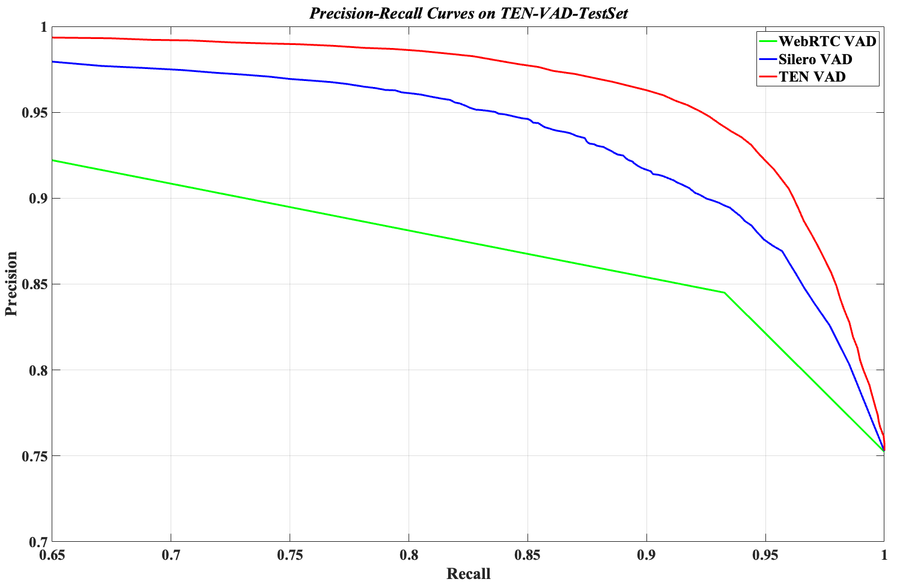
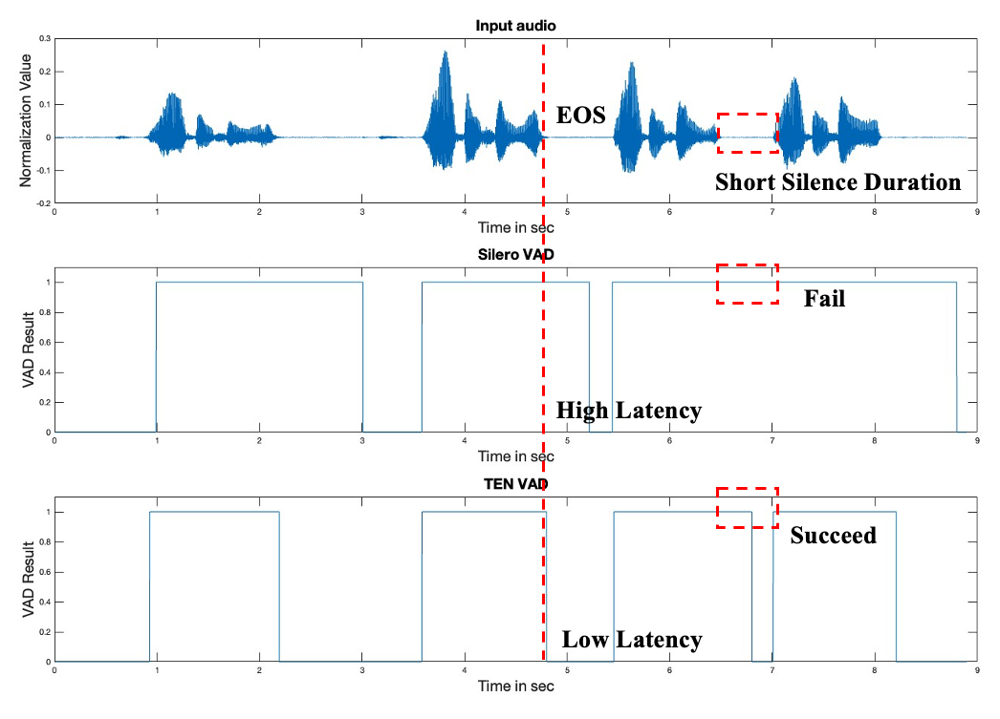
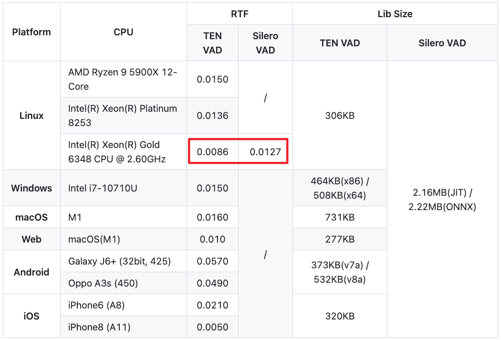

## 4.3 语音活动检测 VAD {#4-3-vad}
**VAD** 是 **Voice Activity Detection** 的简称，即**语音活动检测**，它的核心任务是从一段连续的音频流中，准确、实时地判断出哪一部分是包含人声的“语音段”，哪一部分是只有环境声音的“非语音段”（静音段或噪声段）。

VAD 算法通过分析音频信号的时域和频域特征（如能量、频谱、谐波等），为每一帧音频（毫秒级别）做出一个二元的决策：Speech 或 Non-Speech。这个简单的判断，是现代实时通信和众多语音应用得以高效运行的前提。

### 4.3.1 为什么需要 VAD？ {#4-3-1-why-vad}
    

VAD 不仅能在音频会话的非语音段暂停某些处理过程，以此降低成本和资源消耗，例如在 RTC 传输和语音识别应用中，VAD 可避免对静音数据包进行不必要的编码和传输，从而显著节约计算资源和网络带宽，以及可能的语音识别费用；

在 Conversational AI 中，还能用于检测人机对话中的 SOS（Start Of Sentence）和 EOS（End Of Sentence），以达到响应和打断的功能，其中，VAD 的延迟至关重要，决定了人机对话中响应和打断的速度。除此之外，VAD 还能用于辅助语音前端处理算法的判断以及数据切分等任务。

### 4.3.2 VAD 的技术挑战与核心指标 {#4-3-2-vad-challenges-and-metrics}
    

1. **主要挑战**
    

- 低信噪比：在嘈杂的环境中（如街道、咖啡馆），人声被背景噪声淹没，难以区分。
    
- 非平稳噪声：突如其来的键盘声、纸张翻动声、关门声等，其特性与语音相似，极易造成误判。
    
- 弱语音成分：语音中的清音（如 /s/， /f/）和气音，能量很低，频谱特征与噪声相近，容易漏检。
    

2. **核心性能指标**
    

- 漏检率（False Negative Rate， FNR）：本是语音，却被判为噪声。高漏检率会“剪掉”单词的头部或尾部，导致语音不完整。
    
- 误判率（False Positive Rate， FPR）：本是噪声，却被判为语音。高误判率会传输不必要的噪声，浪费带宽和算力，并且在人机交互中会造成语音合成模块的误打断。
    
- 延迟（Latency）：从音频输入到做出决策的时间。对于实时通信，必须极低。
    
- 计算复杂度（Computational Complexity）：决定了算法的功耗和在资源受限设备上的可行性。
    

### 4.3.3 VAD 在 Conversational AI 中的作用 {#4-3-3-vad-role}
    

在语音交互中，用户不会像输入文字那样用“回车”来表示结束，也不会在开口前发出“准备好了”的信号。语音活动检测（VAD，Voice Activity Detection）的作用，就是替代这些“显性信号”，让 AI 知道什么时候应该开始听、什么时候可以回应。

它主要完成三件事：

- **区分语音与非语音**：过滤背景噪声（如空调声、脚步声）和静音片段，防止系统把杂音误认为人声。
    
- **检测语音起点（SOS, Start of Speech）**：捕捉用户开口的瞬间，触发后续 ASR 模块的启动，并在必要时中断 TTS 输出。
    
- **检测语音终点（EOS, End of Speech）**：判断用户是否说完，通知系统可以开始识别、理解并生成响应
    

可以把 VAD 理解为 AI 的“耳朵管家”：它让系统明白“什么时候认真听”“什么时候开始说”，是自然语音交互的基础。

### 4.3.4 VAD 与延迟的关系  {#4-3-4-vad-latency}
    

对话式 AI 的关键体验指标之一是**自然流畅感**，而延迟则是破坏自然感的最大敌人。VAD 的性能直接影响两类关键延迟：

1. **打断延迟（Interruption Latency）**
    

这决定了 AI 能否“自然地被打断”。

在人类对话中，打断往往发生在毫秒级，AI 若要实现类似体验，就必须在用户一开口时立即识别出“有人在说话”。这依赖于 VAD 对 SOS 的检测速度——越快越自然，越慢则会让系统显得“反应迟钝”。

2. **端到端延迟（End-to-End Latency）**
    

这是从用户说完到 AI 回复的总时间。VAD 的 EOS 检测在其中至关重要——系统必须确定“用户真的说完了”才能进入识别与应答阶段。

这里存在一个典型的**两难问题**：

- **太早截断**：如果用户在思考时短暂停顿（如“我想订一张明天……去北京的机票”），VAD 若误判为结束，会导致语义被切断，ASR 识别出错误指令。
    
- **等待过久**：如果系统等待过长（例如静音超时设置为 3 秒），则即便用户已说完，也要等几秒才响应，造成明显卡顿
    

换句话说，VAD 是语音交互中最小却最关键的“节拍器”。

它既要足够**敏捷**以保证实时性，又要足够**聪明**以避免误判。一个好的 VAD 能让 AI 在 1 秒左右的响应时间内，表现得像一个真正懂“人类节奏”的对话伙伴。

### 4.3.5 基于 AI 的 VAD 实践案例: [TEN VAD](https://github.com/TEN-framework/ten-vad) {#4-3-5-ten-vad}

VAD 的典型实现方法有两种，分别是**基于传统信号处理的方案**，以及**基于** **AI** **深度学习的** **VAD** **方案**。

传统的 VAD 多基于信号处理算法，例如利用音量、能量、pitch（基频）等声学特征来判断语音起止。然而，这类方法天生存在局限：

- **清音问题**：人声中的清音（如 /s/、/f/）不含 pitch，容易被漏检。
    
- **噪声干扰**：环境噪声可能含有与 pitch 相似的结构，导致误判。
    
- **场景适应性差**：不同麦克风、不同环境下表现不稳定。
    

因此，越来越多的系统转向基于深度学习的 AI VAD，通过端到端模型学习复杂的语音特征与语义信息，以获得更稳定、更准确的检测能力。

TEN 团队提出了一种基于 AI 的 VAD 方案，将语音信号和噪声样本共同引入训练集，通过优化的 loss 函数实现了显著优于传统方法的检测精度与鲁棒性。该方案的三个关键词是：

1. **高性能（High Precision）**：在各种信噪比条件下保持稳定性能；
    
2. **Agent-Friendly**：专为实时对话设计，延迟低；
    
3. **轻量高效（Lightweight）**：lib 体积仅约 300KB，RTF 极低。
    

目前，TEN VAD 已被新一代 Kaldi 的 **sherpa-onnx** 支持，可在 ASR 流程或其他 Voice Agent 模块中直接调用。

1. **TEN VAD卓越的检测性能**
    

下图展示了不同 VAD 的 **Precision-Recall (PR)** 曲线。曲线下的面积越大，说明模型性能越优。

在所有 Recall 区间内，TEN VAD 的 Precision 均显著高于传统信号处理方案和当前主流 AI VAD，表现出卓越的稳定性与精度。

2. **更加 Agent-Friendly：低延迟、强响应**
    

TEN VAD 的“低延迟”体现在两个方面：

- **更快检测 EOS（句末）**：在用户说完后，TEN VAD 能更快判定语音结束，从而让 LLM 立即进入推理，显著降低端到端响应延迟。
    
- **精准识别句间静音**：TEN VAD 能识别两句独立语音间的短暂停顿，让 Agent 在更自然的节奏中响应。相比之下，部分 SOTA 模型会错过这种间隙，导致系统“等待过久”，回复不连贯。
    

对于实时 Voice Agent 而言，这种毫秒级的响应差异，直接决定交互是否“像真人一样自然”。

3. **轻量高效：推理快，资源占用低**
    

TEN VAD 的核心库体积仅约 **300KB**，比多数深度学习 VAD 模型小一个数量级，推理时对 CPU 资源的消耗极小。

其 **RTF（Real-Time Factor）** 远低于同类 AI VAD，在资源受限的设备上也能实现高并发与实时性，特别适合需要部署在前端设备（如浏览器端、移动端或嵌入式系统）的 Voice Agent。

