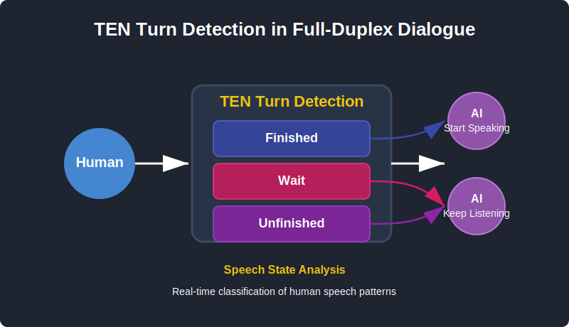

## 4.4 全双工对话中的 Turn-taking（轮次转换）  {#4-4-turn-taking}
### 4.4.1 从半双工到全双工：从“对讲机”到“对话” {#4-4-1-half-to-full-duplex}

传统的语音助手像对讲机——你说完，AI 才能回应。系统通过检测一段“沉默”判断你是否说完，这种机制被称为**半双工（half-duplex）**。而人类对话是全双工（full-duplex）**的：我们能边听边说，甚至在对方话音未落时就已开始准备回应。**

**要让 AI 拥有这种能力，就必须让它像人一样，理解“什么时候轮到谁说话”，这便是**轮次转换（Turn-taking）的核心。

### 4.4.2 轮次转换：全双工对话的核心挑战  {#4-4-2-turn-taking-challenges}

如果说全双工对话是目标，那么轮次转换（Turn-taking）就是实现这个目标必须解决的核心问题。轮次转换研究的是对话中"谁在什么时候说话"的协调机制。

让我们通过一个生活化的例子来理解一下这个概念。假设你在给朋友讲一个精彩的故事：

"昨天我跟我朋友去了一家新开的餐厅……"（你暂停了一下，喝了口水）
这时你的朋友面临一个判断：这里我该接话吗？我应该给出一个反馈，还是安静的继续听你说？
这个看似简单的判断，实际上涉及多个复杂的信号：

1. **转换相关位置（TRP）**

根据 Sacks 等人（1974）的经典定义，TRP 是话轮构建单位（TCU）完成后可能发生话轮转换的位置。但重要的是，TRP 并不是一个二元概念——研究表明它更像是一个**概率连续体**。某个时刻适合转换的程度可以从"几乎不可能"到"高度可能"连续变化。

让我们通过地图任务对话来理解（这是一个 turn-taking 研究的经典场景）：

**场景：A 在给 B 描述地图路线**

```
A: "你看到火山了吗？"
↑ 高TRP概率（~90%）：疑问句完整，期待回答

B: "看到了"
A: "好的，从火山往东走"
↑ 中等TRP概率（~40%）：虽然句子可以在此结束，但语气和上下文的语境都暗示还要继续说下去。

A: "...大概两百米..."
↑ 低TRP概率（~20%）：语义未完整，明显需要继续

A: "...你会看到一个湖。"
↑ 高TRP概率（~85%）：句法和语义都完整
```

**为什么 TRP 是概率性的？**
研究发现，即使在明确的 TRP 位置，话轮转换也只是可能而非必然。根据 Sacks 等人的规则：
    a. 当前说话者可以选定下一个说话者（other-select）
    b. 如果没有选定，任何人可以自我选择（self-select）
    c. 如果无人接话，当前说话者可以继续

这种可选性，加上多种信号的相互作用，使得 TRP 本质上是概率性的。人类对话中典型的 200 毫秒间隙反应时间，说明听者在**预测和准备**，而不是被动等待。

2. **话间停顿单位（IPU）**

IPU 是语音处理中的基础概念，指一段连续的、没有明显停顿的语音。Brady（1965）最早使用这个概念来自动分析话轮模式。技术上，IPU 通过语音活动检测（VAD）来识别，停顿阈值通常设为 200 毫秒。

**关键区分：停顿（Pause） vs 间隙（Gap）**
   - 停顿：同一说话者的 IPU 之间的沉默
   - 间隙：不同说话者 IPU 之间的沉默
  
**研究发现的关键数据：**
- 话内停顿平均时长：**520ms**（Ten Bosch 等，2005）
- 话轮间隙平均时长：**200ms**（Levinson & Torreira，2015）

这个反直觉的发现——停顿比间隙长——说明沉默时长并不是判断话轮结束的可靠指标。如果系统简单地使用 700ms 的沉默阈值：
  - **问题 1**：在 520ms 的思考停顿处错误地接话（打断用户）
  - **问题 2**：在 200ms 的话轮间隙后还在等待（反应迟钝）

这就是为什么现代对话系统需要更复杂的模型，而不能仅依赖沉默检测。

但要注意——**IPU 并不代表句子结束**。很多停顿是“思考停顿”而不是“语义结束”。如果系统简单地在每次静音后就判定用户说完，就会出现“打断”现象。

因此，IPU 只是语音层面的边界，而不是语义层面的轮次边界。

3. **话轮构建单位（TCU）**

话轮构建单位（TCU - Turn Constructional Unit）

Sacks 等人（1974）提出的 TCU 是话轮组织的核心概念。TCU 是在特定语境下能够构成完整交际行为的最小单位。每个 TCU 结束后都有一个 TRP，但不是所有 TRP 都会发生话轮转换。

**Ford & Thompson（1996）的完整性层次：**

a. 句法完整：语法结构完整 
b. 语用完整：构成完整的交际行为 + 具有"终结"韵律

看一个实际例子（改编自 Ford & Thompson 的研究）：
```
情境：朋友讨论周末计划

A: "昨天我们见面了 / 在公园 /"
    ↑句法完整      ↑句法完整
    ↑语用完整      ↓语用不完整（明显是补充信息）

B: "好的 / 什么时候 / 再见面 /"
    ↑完整   ↑不完整    ↑完整
    (省略回答) (疑问词悬空) (完整问题)

A: "明天 /"
    ↑句法 + 语用都完整（在问答语境下）
```

关键洞察：
- Ford & Thompson 发现约 50%的句法完整点也是语用完整点
- 在语用完整点，约 50%会发生实际的话轮转换
- 这说明 TCU 边界是必要但不充分的转换条件
  

**TCU vs IPU**:
```
"我想订一个...[停顿]...大号的...[停顿]...夏威夷披萨"
 |----IPU1----|     |---IPU2---|     |---IPU3---|
 |------------------一个完整的TCU------------------|
```
通过上面这个例子我们可以看到，虽然有 3 个 IPU（物理切分），但只有 1 个 TCU（语义单位）。系统不应在 IPU 边界处接话，而应等待 TCU 完成。

换句话说，TCU 是**语义完成**的边界，而 IPU 只是**语音连续性**的边界。一个完整的句子可能由多个 IPU 构成，但通常只有一个 TCU。

这些线索（TRP、IPU、TCU）共同构成了人类对话中“谁接谁说”的隐性节奏。AI 的任务，就是学会从声音和语义中重建这种节奏。

4. **轮次转换在 Conversational AI 中的作用**

轮次转换是让对话式 AI 从简单问答，进化成对话伙伴的关键技术，它决定了对话式人机交互的流畅性、自然度和用户体验的上限。

1. **自然流畅的对话节奏**：让对话自然流畅的进行是轮次转换最直接和显而易见的作用，高效和准确的轮次转换可以让对话式 AI 在人机交互中实现与人类对话中的轮次毫秒级无缝转换。
2. **全双工交互**：全双工实现了人类的行为，即不仅能听又能说，而且在说的同时也能听。在 AI 产生理解错误，或用户临时改变主意时，用户可以打断 AI，而不用痛苦地等待 AI 讲完，这大幅提高了交互效率和使用体验。
3. **智能社交**：一个优秀的轮次转换，不仅仅是技术问题，更是一种人类的社交礼仪。更智能的轮次转换，可以让 AI 显得更聪明，更绅士，更礼貌。AI 的精准回复和打断，可以让 AI 传递出“我在认真听你说话”的信号。

### 4.4.3 轮次检测（Turn-taking Detection, TTD） {#4-4-3-turn-taking-detection}

工程上有两条常见路线：一条更“硬件友好”的基于声学的方法；一条更“理解导向”的基于语义的方法。多数成熟系统最终采用二者融合。

1. **基于声学的轮次检测（Acoustic Turn-taking）**

最直接的轮次判断方法，是通过声学信号实现。系统利用语音活动检测（VAD）判断用户是否在说话、是否已经说完。VAD 通过检测音频能量、频谱特征和静音长度来判定语音段的起止：

- **开始检测（SOS）**：捕捉用户刚开始说话的瞬间；
- **结束检测（EOS）**：判断用户是否说完一句。

这种方法的优点是轻量、低延迟，适合嵌入式设备和实时场景。但它也有明显局限：

- 无法理解语义——不知道“停顿”是思考还是结束；
- 易受环境噪声影响；
- 无法应对不同用户的语速、口音与说话习惯。

声学方法就像给 AI 装了一对“耳朵”，它能听到声音，但听不懂意图。

2. **基于语义的轮次检测（Semantic Turn-taking）**

要让 AI 真正“懂得接话”，必须让它理解语言本身。语义级轮次检测方法在传统声学特征之外，引入了**语法完整性、语义完整性与韵律模式**等更高层信号。

以 IPU 模型为例：

- 当系统检测到超过 200ms 的停顿时，不会立刻接话；
- 它会结合语法、韵律、上下文信息判断该停顿是否意味着说完。

例如：

> 用户说：“我想要…”（停顿 400ms）“…一个汉堡”
> 系统会等待，因为语法未完成。

> 用户说：“我想要一个汉堡。”（停顿 300ms）
> 系统会判断语法和语义都完整，于是立即回应：“好的，需要饮料吗？”

这种方法更接近人类对话习惯——快速、自然、不冒进。

3. **实践案例：TEN Turn Detection**

在当前主流的 ASR → LLM → TTS 流程中，TEN 团队提出了一个创新实践：**在纯文本层实现 Turn Detection。**

TEN 的系统通过语义理解直接判断文本轮次状态，而不依赖声学信号。TEN Turn Detection 模型通过深度语义理解来判断"文本 IPU"的边界：

它将用户的输入分为三类：

1. **finished（完成）**：句子完整，可以回应。
> 例：“我想订明天去北京的机票。”

2. **unfinished（未完成）**：表达未结束，应继续等待。
> 例：“我想订明天…”

3. **wait（等待）**：用户显式要求系统暂停。
> 例：“等一下，让我查查。”



这种设计不仅保留了自然对话的灵活性，还大幅降低了延迟与误判率。在测试中，TEN Turn Detection 模型在中英文场景下均达到 98% 以上准确率，证明了**语义层轮次判断**可以在缺乏语音特征的情况下依然表现优异。

最新趋势是向**多模态与预测性模型**演进：

- 融合视觉线索（唇动、眼神、表情、手势）
- 融合文本语义，判断说话意图和句子完成度
- 从“检测结束”升级为“预测结束”

目标不再只是“分配说话权”，而是让 AI 成为**真正的对话伙伴**——能在恰当时机“接话”、“附和”、“打断”或“保持安静”，让对话自然得像人与人交谈。