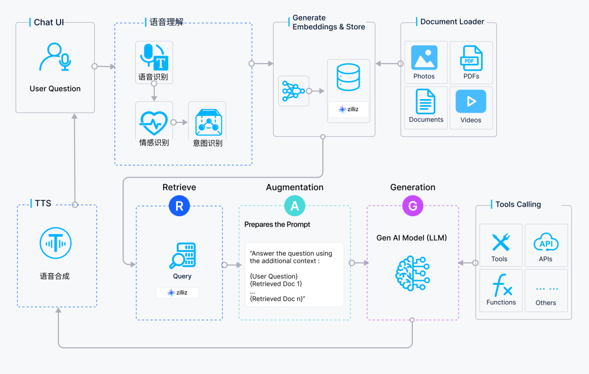

## 6.3 检索增强生成 RAG ：让 AI 查找知识 {#6-3-rag}
对话式 AI 要想真正做到“知道更多”，不能仅靠模型的固有知识。

Memory 让模型记住“你是谁、我们聊过什么”**，而 RAG 则让模型能够访问**“外部世界的知识”。这就像一个有记忆力的朋友，偶尔还会查资料来回答问题。RAG 赋予 对话式 AI 即时检索信息的能力，比如：

- **客服场景**：实时查阅用户订单、工单状态；
    
- **金融助理**：调取最新汇率、交易记录；
    
- **企业助手**：检索内部知识库、产品文档；
    

**总而言之，RAG 的核心作用是**：通过外挂一个实时、可控的知识库，将 LLM 的强大语言能力与外部知识源的准确性和实时性相结合，从而生成更可靠、更精确、更专业的回答。

### 6.3.1 什么是 RAG  {#6-3-1-what-is-rag}
    

RAG，全称 **Retrieval-Augmented Generation（检索增强生成）**，是一种让大语言模型在生成回答之前，主动去“查资料”的机制。

可以把它理解为一个“带搜索引擎的大脑”：当用户向模型提问时，RAG 系统不会仅仅依靠模型内部的知识（即训练时学到的内容），而是先到外部数据库、文档、或知识库中检索相关信息，再将这些资料提供给模型参考，从而生成更加准确、最新、具备事实依据的回答。

### 6.3.2 RAG 的基本架构   {#6-3-2-rag-architecture}
    

RAG 的结构可以分为两部分：

1. **Retrieval（检索层）**
    

- 负责在外部知识源（如数据库、向量库、文档库）中检索与用户问题最相关的信息。
    
- 常见的检索方式包括基于关键词的搜索（BM25）或基于语义的向量检索（Embedding Search）。
    

2. **Generation（生成层）**
    

- 将检索到的资料作为“上下文提示”传入大语言模型中，让模型在回答时参考这些外部信息。
    
- 模型在生成回答时，不再完全依赖自身参数中的知识，而是融合检索结果进行推理与表达。
    

整个流程如下：

1. 用户提出问题（Query）
    
2. 检索模块从外部数据中找到相关内容（Documents）
    
3. 将内容与原始问题拼接，输入给 LLM
    
4. 模型生成最终回答（Answer）
    

### 6.3.3 RAG 和 Memory 区别   {#6-3-3-rag-vs-memory}
    

很多开发者在实现 对话式 AI 时容易混淆 **RAG** 与 **Memory**，因为两者都与“外部知识”有关，但它们在目标和设计上完全不同。

|项目|RAG（检索增强生成）|Memory（记忆系统）|
|---|---|---|
|目标|获取最新的事实与知识|保留用户的长期历史与个性信息|
|数据来源|外部知识库、文档、网页|内部记忆库（用户交互、上下文）|
|生命周期|每次查询动态检索|持续积累并长期保存|
|适用场景|回答知识性问题（如“今天的汇率”）|维护连续性与个性化（如“记得我昨天说过…”）|

简单来说：

- **RAG 是让 AI “会查资料”**
    
- **Memory 是让 AI “会记事”**
    

而在实际系统中，两者往往是协同工作的。RAG 负责扩展事实边界，Memory 负责延续对话脉络。这让 对话式 AI 既能“了解世界”，又能“了解你”。

### 6.3.4 对话式 AI + RAG 架构拆解   {#6-3-4-conversational-ai-rag-architecture}
    

将 RAG 集成到 对话式 AI 中，意味着在系统的决策核心中增加了一个关键的“信息检索”环节。整个系统的架构和工作流程如下：

**核心组件**

1. **语音输入/输出模块 （ASR & TTS）**：负责语音与文本之间的相互转换，是用户与系统交互的桥梁。
    
2. **意图识别与初步处理模块 （NLU & Dialogue Management）**：快速识别用户意图并决定处理路径。如果是一些简单指令（如“播放音乐”），可以直接执行；如果是一个知识密集型问题（如“介绍一下你们最新的产品特性”），则会触发 RAG 流程。
    
3. **RAG 核心模块**：
    
    -  **信息检索器 （Retriever）**：这是 RAG 的核心。当收到一个需要外部知识的问题时，检索器会将问题文本（Query）进行向量化（Embedding），然后在向量数据库（Vector Database）中进行高效的相似度搜索。
        
    - **知识库 （Knowledge Base）**：这里存储了所有供检索的外部知识。这些知识可以是产品文档、网页、API 数据源等，它们预先被处理、切块（Chunking）并转换成向量形式存储。
        
    - **向量数据库 （Vector Database）**：如 Milvus，是专门用于存储和高效查询大规模向量数据的数据库。 当检索器传来查询向量时，Milvus 能够快速返回最相关的文本块（Contexts）。
        
    - **生成器 （Generator）**：通常是一个大型语言模型（LLM）。它接收原始的用户问题和从向量数据库中检索到的相关上下文信息，然后生成一个既流畅又精准的回答。
        

**工作流程详解**

1. **语音转文本**：用户发出语音提问，ASR 系统将其转换为文本。
    
2. **意图判断**：NLU 分析文本，判断这是一个需要 RAG 介入的知识查询任务。
    
3. **检索 （Retrieve）**：将用户的问题文本输入信息检索器，检索器在向量数据库中查找最相关的知识片段。
    
4. **增强 （Augment）**：将检索到的知识片段与用户的原始问题打包成一个增强的提示（Prompt）。
    
5. **生成 （Generate）**：将这个增强的提示发送给 LLM，LLM 基于这些信息生成最终的文本答案。
    
6. **文本转语音**：TTS 模块将生成的文本答案转换成语音，播放给用户。
    

### 6.3.5 实践与优化建议   {#6-3-5-rag-suggestions}
    

构建一个高性能的 对话式 AI + RAG 系统并非易事，开发者需要关注以下几个关键挑战：

1. **延迟问题**
    

语音交互对实时性要求极高。整个“ASR -> NLU -> RAG -> LLM -> TTS”的链条必须在极短的时间内完成，通常要求在半秒以内才能保证对话的流畅性。 RAG 中的检索和 LLM 的生成都是潜在的耗时环节。

**最佳实践**：优化检索算法、使用高性能的向量数据库（如 Milvus）、选择响应速度更快的 LLM 模型，并采用流式（Streaming）ASR 和 TTS 技术，即边识别/边合成，来缩短用户等待时间。

2. **检索质量**
    

RAG 系统的上限取决于检索的质量。如果检索出的内容不相关或质量低下，生成结果也会差。

**最佳实践**：优化文档的切块策略（Chunking Strategy），改进嵌入模型以更好地理解语义，并采用重排序（Re-ranking）模型来优化检索结果。

3. **数据隐私与安全**
    

当知识库包含敏感信息时，如何确保数据在检索和生成过程中不被泄露是一个重要问题。

**最佳实践**：采用本地化部署方案，对敏感数据进行加密和匿名化处理，并建立严格的访问控制机制。

4. **上下文管理**
    

在多轮对话中，如何准确理解用户的指代（如“它怎么样？”），并结合上下文进行有效检索，是一个核心难题。

**最佳实践**：设计强大的对话管理器来维护和传递对话历史，或者在检索前对用户问题进行改写，融入上下文信息。

通过将 RAG 技术与传统的 对话式 AI 架构相结合，开发者可以构建出远超传统智能音箱能力的、真正“知识渊博”且可靠的语音助手。 它们不仅能处理日常指令，更能成为特定领域的专家，在客户服务、企业知识问答、智能座舱等场景中发挥巨大价值。