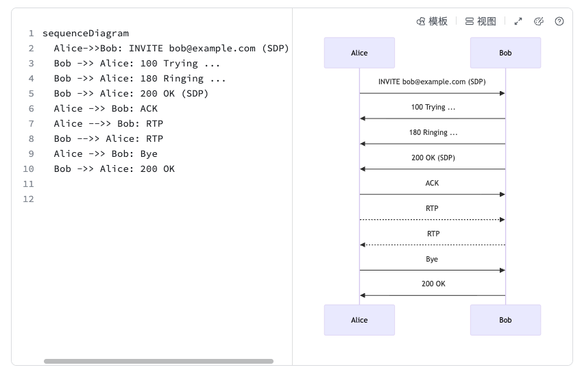

## 7.1 什么是 SIP？ {#7-1-what-is-sip}
SIP 的全称是 **Session Initiation Protocol**，即**会话初始协议**。顾名思义，它主要就是用于**控制通信会话的建立和销毁的协议**。

### 7.1.1 SIP 的基础概念  {#7-1-1-sip-concepts}
    

**SIP 是一个信令协议，它用于在参与通信的双方传输控制信号**。SIP 不负责传输语音或视频内容，而是负责 “谁和谁通话、什么时候开始、什么时候结束” 这类“协调工作”。

我们可以用一列火车的旅程来类比：

- **SIP** 就像调度员，负责安排列车出发、进站和到达。它不会亲自运送乘客，但会告诉各个车站列车何时到达、从哪条轨道进入、开往何处——这些调度信息就叫做 **信令（Signaling）**。
    
- **UDP** 就像铁轨，提供传输通道，让火车能顺利从一站跑到另一站。
    
- **RTP（Real-Time Protocol）** 就是那列真正跑在轨道上的 **火车**，负责运输内容。
    
- 而火车上装载的“乘客”或“货物”——也就是通信中的实际内容，比如语音或视频数据——就叫做 **媒体（Media）**。
    

因此，一个完整的通信过程可以这样理解：SIP 先通过信令完成调度（比如“准备发车”“到站”等），RTP 再在 UDP 轨道上承载媒体数据进行实时传输。

和看电影、听广播这种“单向播放”不同，电话或语音对话是 **双向实时通信**。这意味着它对延迟极其敏感——如果声音延迟超过 500ms，你就能明显感觉到卡顿；超过 1 秒，双方往往会“抢话”。

不过，人类对语音的容忍度很高。偶尔漏掉几个字，仍能通过语境理解意思。相比之下，如果为了保证每个字都准确而频繁重传，反而会导致延迟更高，对话变得不自然。这也是为什么语音通话普遍选择 **UDP** 而非 **TCP**——**实时性比完美性更重要**。

为了进一步提高稳定性，现代音频系统通常会结合 **FEC（前向纠错）** 与 **拥塞控制** 技术，即使在超过 50% 丢包率的极端网络条件下，也能维持可理解、可沟通的语音质量。

### 7.1.2 一个简单的 SIP 交互示例  {#7-1-2-sip-call-flow-simple}
    

在理解了 SIP 在通信体系中的角色之后，我们再来看它在一次“通话”中具体是怎么工作的。

在电话通信的场景中，SIP 用于建立（打电话）和释放通话（挂机），而 RTP 协议用于传输通话的内容（音频本身）。一个大大简化后的 SIP 呼叫示例大概长这样：

```YAML
INVITE 5678@example.com
From: 1234@example.com
To: 5678@example.com
Content-Type: application/sdp
Content-Length: xxxx

v=0
c=IN IP4 1.2.3.4
m=audio 4000 RTP/AVP 0
```

SIP 看起来有点像 HTTP ——这并非巧合。SIP 的设计确实参考了 HTTP，包括 **Digest（摘要）鉴权** 机制。

不同的是，HTTP 是**单向协议，** 即“客户端-服务器”架构的协议。客户端（通常是浏览器）只能请求服务器，而服务器不能向客户端发起请求。而 SIP 是**点对点协议**，意味着双方都能主动发起呼叫，“你可以呼我，我也能呼你”。

看上面的 SIP 消息，可以简单理解为一次“拨号邀请”。**INVITE** 表示发起通话，**From** 是主叫方，To 是被叫方，它们都使用类似电子邮件的地址格式（即 SIP URI）来标识身份。

消息体（Body）部分是一个 **SDP（Session Description Protocol，会话描述协议）**，用于描述通话的具体参数，比如：

- **通信地址与端口**：示例中音频的 IP 地址是 1.2.3.4，端口是 4000。
    
- **音频编码方式**：示例中的编码是 PCMU（编号 0）。与之类似的还有 PCMA，两者略有差异。一般来说，欧洲和中国使用 PCMA，北美和日本使用 PCMU。为了确保兼容性，SIP 标准要求所有设备必须支持这两种编码。
    
- **媒体类型**：即通话中要传输的是音频、视频还是其他数据。
    

简单来说，SIP 用于“建立会话”，而 SDP 则用于“描述会话”。前者负责让两端“接上电话”，后者负责说明“通话该怎么进行”。

### 7.1.3 一个完整的 SIP 交互示例  {#7-1-3-sip-call-flow-full}
    

下面，我们是一个完整的 SIP 信令交互流程。



在一次完整的通话中，SIP 的流程大致如下：

1. **呼叫建立（INVITE 阶段）**
    
    - 主叫方（如 Alice）通过 INVITE 消息发起通话请求。
        
     -  被叫方（如 Bob）收到请求后，会先返回一个临时响应（1xx 消息，例如“正在振铃”）。
        
    - 当 Bob 接听时，返回 200 OK，表示同意接通。
        
2. **确认与连接（ACK 阶段）**
    
    - Alice 收到 200 OK 后，会回发 ACK 消息作为确认。
        
    - 至此，双方的 SIP 握手完成，会话（Session）正式建立。
        
3. **媒体传输（RTP 阶段）**
    
    - 双方通过前面 SDP 中约定的 IP、端口和编码参数，建立起 RTP 通道，
        
    - 开始传输真实的音频数据，进行实时语音通话。
        
4. **通话结束（BYE 阶段）**
    
    - 当任意一方挂断时，会发送 BYE 消息；
        
    - 对方收到后返回 200 OK，表示通话释放完成。
        

可以看到，SIP 自始至终都不直接承载语音内容，它的职责是 **“建立通道”** 和 **“拆除通道”**，

真正的语音数据传输仍由 RTP 完成。

SIP 协议可以在多种网络传输方式上运行：它既可以使用 UDP（低延迟）、也可以使用 TCP（更可靠）、甚至通过 TLS（加密传输）。

随着互联网和 Web 技术的发展，浏览器端也逐渐需要具备实时音视频通信能力。但浏览器中并不能直接使用 UDP 或 TCP，因此，一般采用 **WebSocket** 来承载 SIP 消息。这种方式被称为 **SIP over WebSocket**。